# Human-pose-estimation
Human pose estimation

## Installation

- Clone the Repository:                                                
  ```bash 
  git clone https://github.com/Jd8111997/Human-pose-estimation
  ```                   
- Navigate to the Simple-HRNet Subdirectory:                              
  ```bash
  cd simple-HRNet
  ```                     
- Install Required Packages:  
  ```bash
  pip install -r requirements.txt
  ```                   
- Install the Ultralytics package                                           
  ```bash 
  pip install ultralytics
  ```                      
- Obtain YOLOv5:                                              
    - Clone [YOLOv5](git clone https://github.com/ultralytics/yolov5)
into the ``./models_/detectors`` folder and change the folder name from ``yolov5`` to ``yolo``.                                
- Download the official pre-trained weights for the model:                     
    - For COCO w48 384x288 (Default in inference.py):
      [pose_hrnet_w48_384x288.pth](https://drive.google.com/open?id=1UoJhTtjHNByZSm96W3yFTfU5upJnsKiS)                                     
    - Create a new weights directory within the main repository and copy the downloaded pre-trained weights there.                              
- Optional Uninstallation (For CPU-Only Machine):
  - Uninstall the `nvidia_cublas_cu11` package:                   
  ```bash 
  pip uninstall nvidia_cublas_cu11
  ```   

## Usage

- The `inference.py` script analyzes human poses in images, offering the ability to detect bounding boxes and keypoints. Below are the available options:


```bash
python inference.py [-h] [--visualize] [--output_folder_name OUTPUT_FOLDER_NAME] image_path
```

- `image_path`: Path to a single image or a directory containing multiple images.
- `--visualize`: Flag to enable visualization of bounding box detection and keypoints in the input image.
- `--output_folder_name OUTPUT_FOLDER_NAME`: Path to the output directory to save the final output images with visualizations.

## Output

Upon executing the `inference.py` script, it runs a human pose estimation model and prints a dictionary containing model output at the end. This dictionary comprises:

- **Key**: Represents the name of the input image.
- **Value**: A nested dictionary containing:
  - **bounding_box**: A numpy array indicating the detected bounding box coordinates of the human.
  - **key_points**: A numpy array containing 17 keypoints for the detected human within the bounding box.

For Example: 

```python
{'baseball1.jpg': {'bounding_box': array([[141,  45, 618, 681]], dtype=int32), 'key_points': array([[[     144.38,      372.88,      1.0009],
        [     131.12,      372.88,     0.87439],
        [     137.75,      359.62,     0.98067],
        [     117.88,      319.88,     0.48314],
        ...
        [     561.75,      200.62,     0.88002]]], dtype=float32)}}
```
## Visualization of model output

The pre-trained model demonstrates strong performance when analyzing diverse images to detect human poses. Particularly, it excels in detecting human poses within CCTV footage. Additional images are attached in the assets.

<p align="center">
    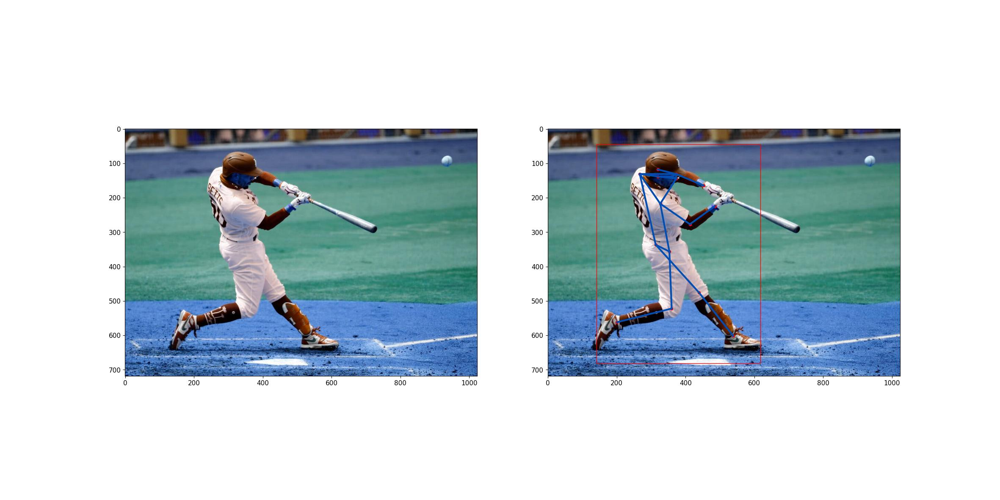<br/>
</p>

<p align="center">
    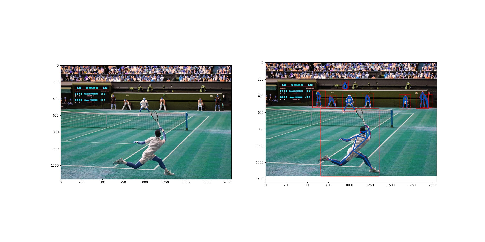<br/>
</p>

<p align="center">
    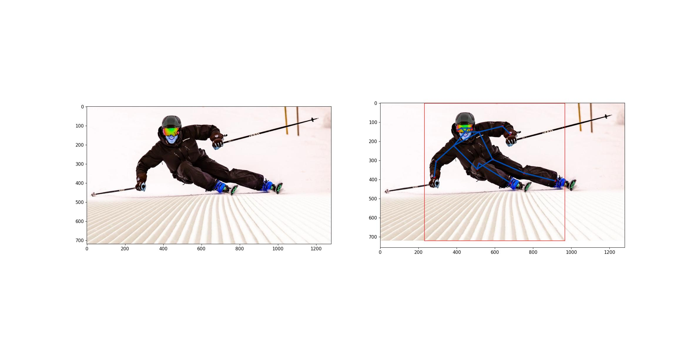<br/>
</p>

<p align="center">
    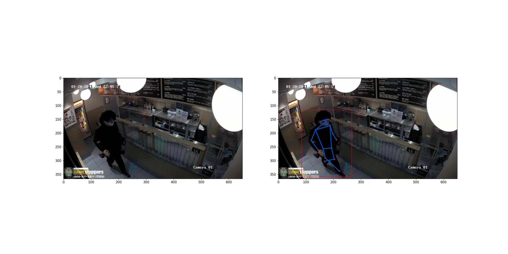<br/>
</p>

<p align="center">
    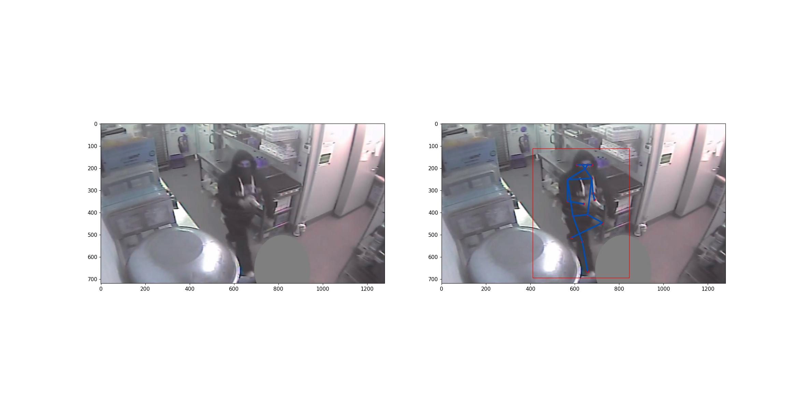<br/>
</p>

<p align="center">
    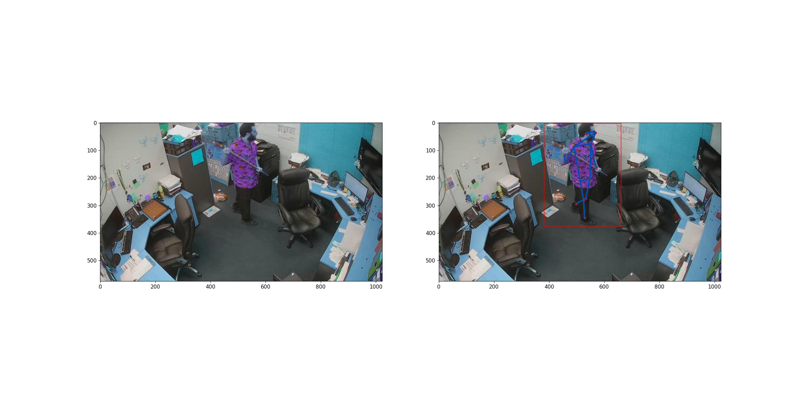<br/>
</p>

## Limitations

- Although this pre-trained model is trained on the COCO keypoints dataset, it performs admirably well in detecting human poses across different test distributions and in real CCTV footages. However, further testing is essential on diverse datasets and various edge cases, including different occlusions, viewing angles, and various background contexts.
- This repository utilizes the open-source simple HRNet model for human pose detection. It follows a top-down approach, initially detecting humans using an object detector and then extracting key points through another deep learning model applied to the object detector's output. Consequently, the model's accuracy heavily relies on the performance of the underlying object detector. Some images exhibit missed detections or false positives by the object detector, leading to reduced accuracy in key point detection.
- Being pretrained on the COCO keypoints dataset, this model is constrained to regress only 17 keypoints. To identify more intricate keypoints, fine-tuning becomes necessary.
- In specific images, as illustrated below, the predicted bounding box occasionally fails to encompass the entire human body. Consequently, the key-point detector network struggles to effectively regress all keypoints.
<p align="center">
    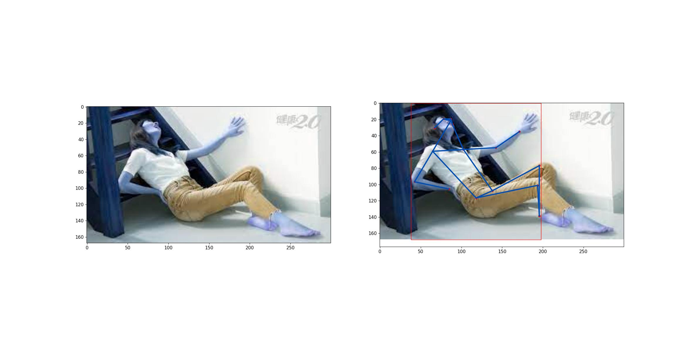<br/>
</p>
- In certain test images, multiple overlapping bounding boxes are present, resulting in the prediction of redundant key points. Additionally, when multiple humans are in close proximity within the image, it directly impacts the performance of the key-point detection model. Several examples showcasing these scenarios are presented below.

<p align="center">
    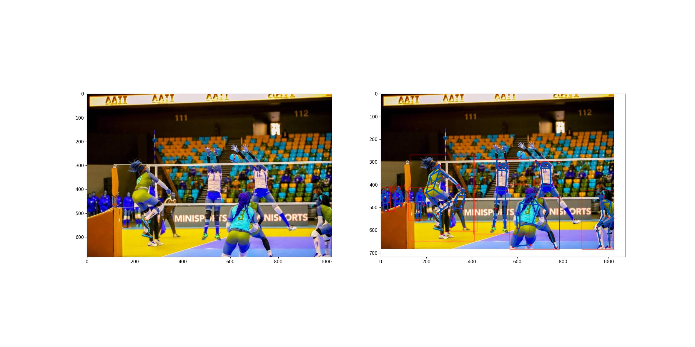<br/>
</p>

<p align="center">
    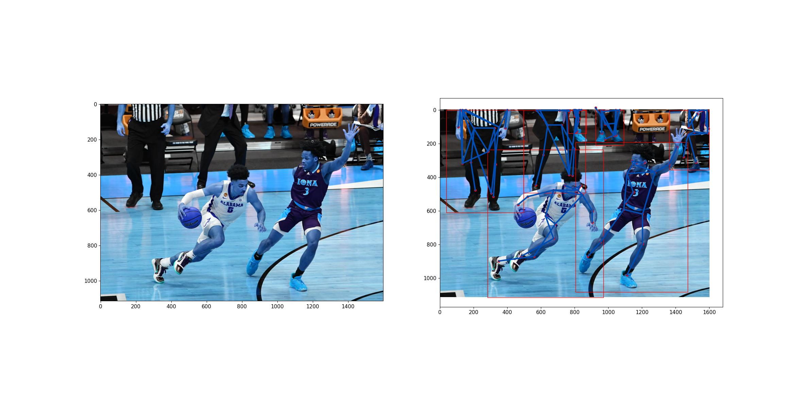<br/>
</p>

<p align="center">
    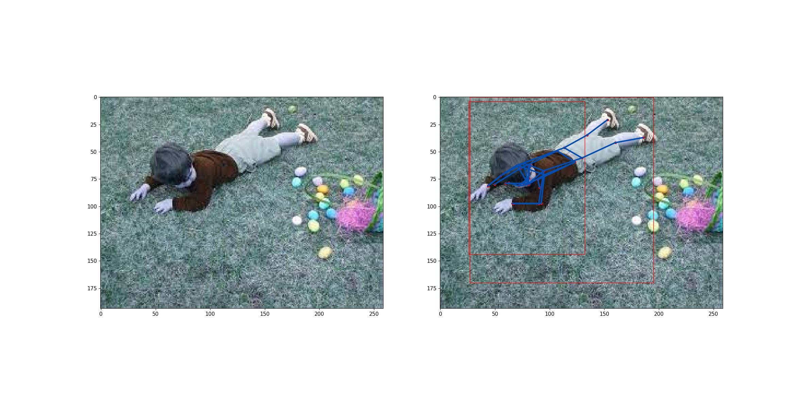<br/>
</p>

<p align="center">
    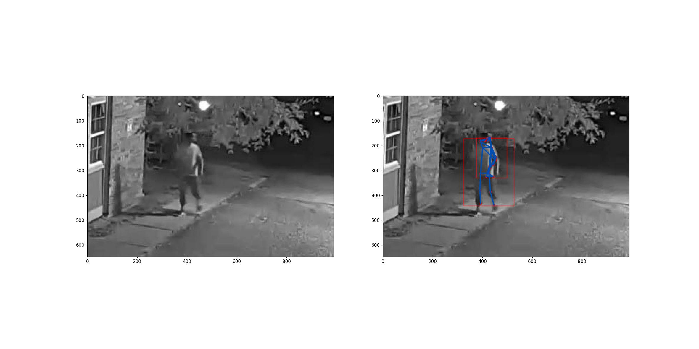<br/>
</p>

## Improvements
  - As it's a pretrained model, fine-tuning for specific tasks is essential to enhance model accuracy.
  - The default object detector in inference.py is YOLOv5 nano, known for its lightweight (only 3.75 million parameters) nature. Users can modify inference.py to experiment with heavier models like YOLOv5 medium and YOLOv5 large for improved object detection accuracy. However, this may increase inference time.
  - In default settings, the script runs with an inference time of approximately 1.5 seconds on a CPU-only machine with 8GB RAM. Deploying it on a GPU machine can significantly enhance the inference speed. Additionally, leveraging TensorRT with the simple-HRNet package can optimize inference time.
  - While simple-HRNet is an older method (released four years ago), there exist multiple state-of-the-art approaches for enhancing key point detection accuracy. Consider exploring the MMPose framework, supporting various cutting-edge human pose detection models for effective deployment.

## Reference

- https://arxiv.org/abs/1902.09212
- https://github.com/stefanopini/simple-HRNet/
- https://github.com/ultralytics/yolov5

